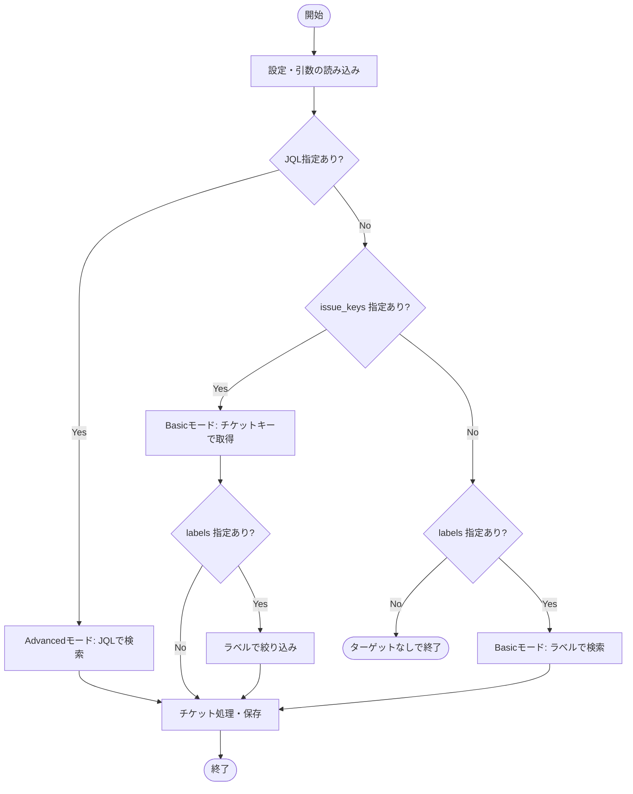

# Jira to Markdown Exporter (J2M-Export)

Jira Data Center のチケット情報を REST API で取得し、AIナレッジ向けに Markdown へエクスポートするローカルCLIツールです。

## 特徴

- Jira Data Center v10.3.9 対応 (REST API)
- チケットの「説明」や「コメント」を Markdown に変換
- JQL による一括エクスポート対応
- 特定のチケットキー指定によるエクスポート対応
- HTTP/HTTPS Proxy (CONNECTトンネル) 対応
- 出力ファイルサイズ制限機能

## セットアップ

Python 3.8以上が必要です。

```bash
pip install -r requirements.txt
```

## 実行方法

### 1. 設定ファイルの準備

リポジトリ直下の `j2m_config_sample.yaml` を `j2m_config.yaml` にコピーし、環境に合わせて内容を編集してください。

```bash
cp j2m_config_sample.yaml j2m_config.yaml
```

`j2m_config.yaml` の例:

```yaml
base_url: "https://your-jira.com"
token: "your_bearer_token_here"
issue_keys:
  - "PROJ-1"
  - "PROJ-2"
# または JQL を使用
# jql: "project = PROJ AND status = Done"
output_dir: "output"
```

### 2. 実行

最も簡単な実行方法:

```bash
python -m j2m_export.cli
```

引数で上書きして実行:

```bash
python -m j2m_export.cli --base-url https://other-jira.com --token other_token --issue-keys PROJ-123 PROJ-456
```

## チケット収集ロジック

本ツールには、簡易的に指定する「Basicモード」と、JQLを駆使する「Advancedモード」があり、JQLの指定がある場合は常にAdvancedモードが優先されます。
また、チケット選択に関する引数（jql, issue_keys, labels）が一つでもコマンドライン引数で指定された場合、設定ファイル内のチケット選択設定はすべて無視されます。

### Advancedモード
`jql` が指定されている場合に有効になります。指定されたJQLクエリのみを使用してチケットを収集し、`issue_keys` や `labels` の指定は無視されます。

### Basicモード
`jql` が指定されていない場合に有効になります。チケットキー（`issue_keys`）やラベル（`labels`）を組み合わせて対象を絞り込みます。

#### 1. チケットキー（issue_keys）による指定
特定のチケットを直接指定してエクスポートします。複数をスペース区切り（CLI）またはリスト形式（YAML）で指定可能です。
- **CLI**: `--issue-keys PROJ-1 PROJ-2`
- **YAML**:
  ```yaml
  issue_keys:
    - "PROJ-1"
    - "PROJ-2"
  ```

#### 2. ラベル（labels）による指定
指定したラベルの**いずれか**を持つチケットを抽出します（OR条件）。
- **CLI**: `--labels target-a target-b`
- **YAML**:
  ```yaml
  labels:
    - "target-a"
    - "target-b"
  ```

#### 3. キーとラベルの組み合わせ
`issue_keys` と `labels` の両方を指定した場合、**指定したキーのチケットの中で、さらに指定したラベルのいずれかを持つもの**だけが抽出されます（Keys と Labels の間は AND条件）。

例：`PROJ-1` (ラベル: `A`), `PROJ-2` (ラベル: `B`) があるとき、`--issue-keys PROJ-1 PROJ-2 --labels A` と指定すると、`PROJ-1` のみがエクスポートされます。



## パラメータ

- `--base-url`: JiraのベースURL
- `--issue-keys`: エクスポートするチケットID（複数指定可能。スペース区切り）
- `--jql`: 対象を特定するJQLクエリ
- `--labels`: 対象とするラベル（複数指定可能。スペース区切り。指定されたラベルのいずれかを持つチケットのみを抽出）
- `--output-dir`: 出力先ディレクトリ
- `--max-mb`: 出力ファイルの最大サイズ(MB)
- `--stop-threshold-mb`: 処理を停止する閾値(MB)
- `--proxy`: プロキシURL
- `--config`: 設定ファイルパス
- `--token`: Bearerトークン
- `--exclude-fields`: 除外するフィールドの内部ID（複数指定可能。スペース区切り）

## ファイル名規則

出力ファイル名は以下の形式になります：
`【<projectKey>】 <サマリー>.md`

ファイル名に使用できない文字（`\ / * ? : " < > |`）は自動的に削除され、長さは最大100文字に制限されます。
同名のファイルが既に存在する場合、衝突を避けるために末尾にチケットキーが付与されます。
例: `【PROJ】 サマリー (PROJ-123).md`

## サイズ制限の挙動

- 出力ファイルの合計サイズが `--stop-threshold-mb` (既定95MB) を超える見込みになった時点で、新しいチケットの取得を停止し、それまで取得した内容をファイルに書き出します。
- 最終的な合計サイズが `--max-mb` (既定100MB) を超えた場合は、ログに合計サイズが表示されますので確認してください。

## よくあるエラーと対処方法

- **401/403 Unauthorized/Forbidden**:
  - 現象: チケットの取得に失敗する。
  - 原因: トークンが無効、期限切れ、または対象チケットへの閲覧権限がない。
  - 対処: `j2m_config.yaml` の `token` が正しいか、および対象のJiraプロジェクトにアクセス可能か確認してください。
- **404 Not Found**:
  - 現象: 指定したチケットキーが見つからない。
  - 原因: チケットキーの間違い、またはベースURLの設定ミス。
  - 対処: チケットキーが正しいか、また `base_url` に正しいホスト名が設定されているか確認してください。
- **Connection Error / Proxy Error**:
  - 現象: リクエストに失敗する。
  - 原因: ネットワークの不通、またはプロキシ設定の誤り。
  - 対処: ネットワーク接続を確認し、必要に応じて `--proxy` オプションまたは環境変数（`HTTPS_PROXY`）でプロキシを指定してください。
- **Configuration error**:
  - 現象: 実行時にエラーが発生して停止する。
  - 原因: `base_url` や `token` などの必須設定が不足している。
  - 対処: `j2m_config.yaml` を作成するか、コマンドライン引数で必須パラメータを指定してください。

### 標準フィールドの指定 (内部ID)

`--exclude-fields` や設定ファイルの `exclude_fields` で指定可能な主な標準フィールドは以下の通りです。

| 内部ID | 表示名 (例) | 説明 | 無視(除外)設定 |
| :--- | :--- | :--- | :--- |
| `summary` | サマリー | チケットのタイトル | 不可 |
| `project` | プロジェクト | 所属プロジェクト | 不可 |
| `status` | ステータス | 現在のステータス | 不可 |
| `assignee` | 担当者 | 現在の担当者 | 不可 |
| `created` | 作成日 | チケットの作成日時 | 不可 |
| `priority` | 優先度 | チケットの優先順位 | 可能 |
| `reporter` | 報告者 | チケットの作成者 | 可能 |
| `updated` | 更新日 | 最終更新日時 | 可能 |
| `duedate` | 期限 | 完了予定日 | 可能 |
| `resolution` | 解決策 | 解決のステータス | 可能 |
| `labels` | ラベル | 付けられたラベルのリスト | 可能 |
| `components` | コンポーネント | 関連するコンポーネント | 可能 |
| `fixVersions` | 修正バージョン | 修正が反映されるバージョン | 可能 |
| `versions` | 影響バージョン | 影響を受けるバージョン | 可能 |
| `issuetype` | 課題タイプ | バグ、タスク、改善など | 可能 |

※ これら以外にも、Jira APIから取得可能な標準フィールド（カスタムフィールドを除く）は網羅的に出力されます。

## 出力フィールド一覧

エクスポートされる主なフィールドは以下の通りです。これら以外の標準フィールドも、値が存在すれば出力されます。

| フィールド名 | Jira内部ID | 内容 |
| :--- | :--- | :--- |
| サマリー | `summary` | チケットのタイトル |
| キー | `key` | チケットID (例: PROJ-123) |
| プロジェクト | `project` | 所属プロジェクト名 |
| ステータス | `status` | 現在のステータス |
| 優先度 | `priority` | チケットの優先順位 |
| 担当者 | `assignee` | 現在の担当者 |
| 報告者 | `reporter` | チケットの作成者 |
| 作成日 | `created` | チケットの作成日時 |
| 更新日 | `updated` | 最終更新日時 |
| 期限 | `duedate` | 完了予定日 |
| 解決策 | `resolution` | 解決のステータス |
| URL | (自動生成) | Jiraチケットへの直接リンク |
| 説明 | `description` | チケットの詳細説明 (Markdown変換) |
| コメント | `comment` | 投稿されたコメント履歴 (Markdown変換) |

## 出力サンプル

エクスポートされる Markdown ファイルの構造サンプルです。

```markdown

---
# ログイン画面でエラーが発生する
- **Key**: PROJ-123
- **Project**: サンプルプロジェクト
- **Status**: Open
- **Priority**: High
- **Assignee**: 山田 太郎
- **Reporter**: 佐藤 次郎
- **Created**: 2024-01-01T10:00:00.000+0900
- **Updated**: 2024-01-02T15:30:00.000+0900
- **URL**: https://your-jira.com/browse/PROJ-123

## Description
ログインボタンをクリックすると、500エラーが発生します。
再現手順:
1. トップページにアクセス
2. ユーザー名とパスワードを入力
3. ログインをクリック

## Comments

### Comment by 山田 太郎 (2024-01-02T11:00:00.000+0900)
現在調査中です。ログを確認します。

### Comment by 鈴木 花子 (2024-01-02T14:00:00.000+0900)
特定のブラウザでのみ発生している可能性があります。
```

---

# Jira to Markdown Exporter (J2M-Export)

A local CLI tool to export Jira Data Center ticket information to Markdown for AI knowledge bases using the REST API.

## Features

- Supports Jira Data Center v10.3.9 (REST API)
- Converts ticket "Description" and "Comments" to Markdown
- Supports bulk export via JQL
- Supports export by specific issue keys
- HTTP/HTTPS Proxy support
- Output file size limit functionality

## Setup

Requires Python 3.8+.

```bash
pip install -r requirements.txt
```

## Usage

### 1. Prepare Configuration

Copy `j2m_config_sample.yaml` to `j2m_config.yaml` and edit it.

```bash
cp j2m_config_sample.yaml j2m_config.yaml
```

### 2. Run

```bash
python -m j2m_export.cli
```
